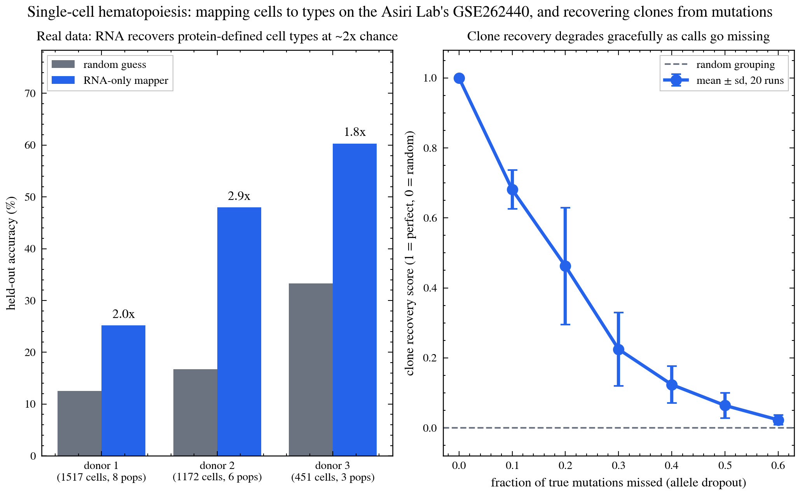

# singlecell-hematopoiesis

Two questions blood-cancer researchers ask about single cells, answered with
small, testable code:

1. **What kind of cell is this?** Given a cell we've never seen, match it to
   the closest known type in a labeled reference (like matching a face to a
   photo album).
2. **Which cells came from the same clone?** Cancer grows as families of cells
   that share the same mutations. Given a table of which cell has which
   mutation, group the cells back into their families.

I built this after reading the Asiri Lab's (Stanford) single-cell map of human
blood-cell development and their work tracking leukemia clones through
treatment. It's my own independent project, not affiliated with the lab.

## What it does



**Left:** on test data with 8 known cell types, the matcher gets every cell
right (each row lights up only on its own diagonal).

**Right:** clone recovery works well when mutation calls are clean, then
degrades as more calls go missing. In real single-cell DNA sequencing, a
mutation is often missed even when it's there (called "dropout"), so I test
how much of that the method can tolerate. Score of 1 = perfect grouping,
0 = random.

## Try it in 30 seconds (no data needed)

```bash
pip install -r requirements.txt
python scripts/selfcheck.py
```

This makes fake cells and fake clones where I *know* the right answer, then
checks the code finds it.

## Run it on real data

The reference-matching part expects a labeled single-cell dataset (an `.h5ad`
file, the standard format). `scripts/prep_scrna.py` is a starting point for
loading one; it's not finished yet. The natural next step is to run it against
the Asiri Lab's published reference (GEO accession GSE262440).

## What's in here

```
src/sceval/mapping.py   match new cells to known types
src/sceval/clonal.py    group cells into clones by shared mutations
src/sceval/synth.py     make fake data with known answers, for testing
scripts/selfcheck.py    quick test on fake data
scripts/make_figures.py makes the figure above
```

## License

MIT
